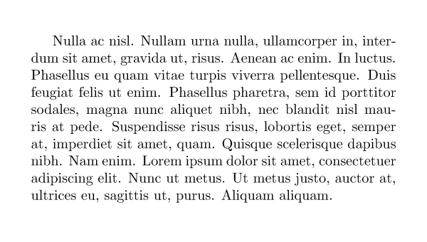
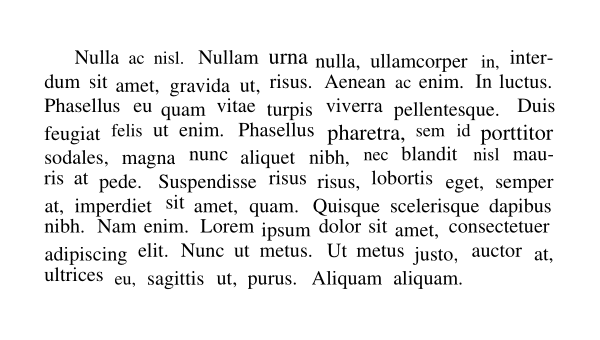

The visible contents of a DjVu file are well-compressed images (see [LeCun's project page](http://yann.lecun.com/ex/djvu/index.html)). But a DjVu file also contains a "text layer" stored as metadata attached to invisible rectangular blocks. PDF does not support such constructs, so we do a little hack.

We render each page as an image and put it as a background in the PDF. We then use a font, [`invisible1.ttf`](https://github.com/kcroker/dpsprep/blob/master/src/dpsprep/invisible.ttf), taken from ["ifw2kxp"](https://web.archive.org/web/20230926193617/https://www.angelfire.com/pr/pgpf/if.html), to "draw" text. Every time we draw a block of text, we rescale the font so that the width of the text matches that of the corresponding DjVu block.

> [!NOTE]
> The font is small (12kb) and contains (invisible) Latin, Cyrillic and Greek characters. Even Chinese characters seem to be working correctly, at least with [Evince](https://gitlab.gnome.org/GNOME/evince).

The following screenshot displays the result of converting a DjVu document:

The following screenshot displays the same document without the background image and with the invisible font replaced by Times New Roman:

Since the image is actually drawn on top of the text, there is no harm in using an actual visible font, possibly rendered using a transparent "color". Still, when searching and selecting text, the scrambled letters from the second image would be highlighted. With the invisible font, there are no visible glyphs to highlight, so an illusory "block" containing the text is highlighted instead.

See [`text.py`](https://github.com/kcroker/dpsprep/blob/master/src/dpsprep/outline/text.py) for the implementation.
